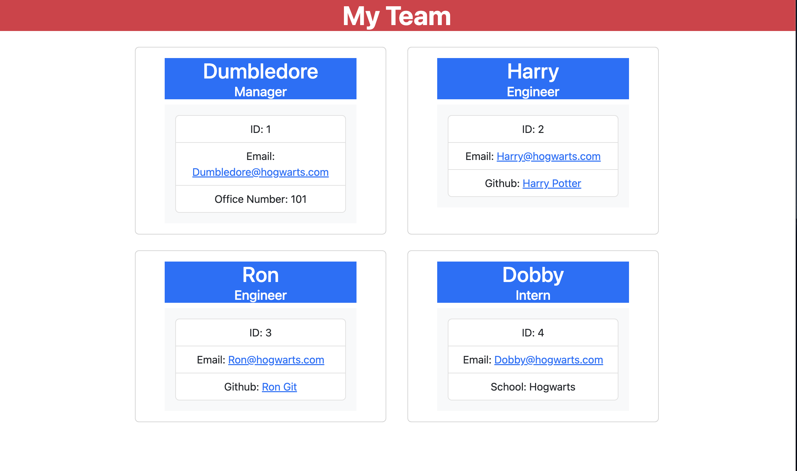

# 10_Object-Oriented-Programming-Team-Profile-Generator

# Description
This is a command line application built using Node and the Inquirer package to generate an HTML page utlizing data inputs by a user. 

# Acceptance Criteria
I updated the  code to meet the following acceptance criteria:

GIVEN a command-line application that accepts user input
WHEN I am prompted for my team members and their information
THEN an HTML file is generated that displays a nicely formatted team roster based on user input
WHEN I click on an email address in the HTML
THEN my default email program opens and populates the TO field of the email with the address
WHEN I click on the GitHub username
THEN that GitHub profile opens in a new tab
WHEN I start the application
THEN I am prompted to enter the team manager’s name, employee ID, email address, and office number
WHEN I enter the team manager’s name, employee ID, email address, and office number
THEN I am presented with a menu with the option to add an engineer or an intern or to finish building my team
WHEN I select the engineer option
THEN I am prompted to enter the engineer’s name, ID, email, and GitHub username, and I am taken back to the menu
WHEN I select the intern option
THEN I am prompted to enter the intern’s name, ID, email, and school, and I am taken back to the menu
WHEN I decide to finish building my team
THEN I exit the application, and the HTML is generated

# Installation

npm install to install required npm packages
Install Node.js to run application

# Usage
type npm run test in the command line to run test scripts
The application will initiate when the user enters node index.js in the command line
The user will be prompted to enter information about each employee
Once the user is done creating their team, the html document will be created in the dist folder. 

# Screenshot

# Video Demo
[Untitled_ Sep 2, 2022 4_06 PM.webm](https://user-images.githubusercontent.com/70189946/188245539-2da03beb-5e64-4af7-9504-a31927afa19c.webm)
